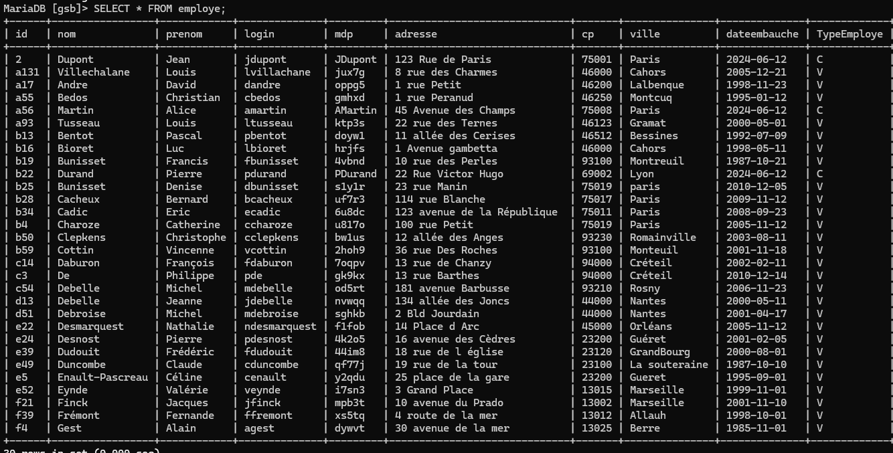

## Livrable 1

### Modification / Développement de l'environnement

#### Différencier les visiteurs des comptables.

Nous allons commencer par modifier la table visiteurs.
``````bash
# Ouvrir l'interface du serveur MariaDB
multipass shell atelier2db

# Se connecter à la base
sudo mysql -u root -p
``````
```sql
--Préciser que lon utilise la base gsb
USE gsb;

--Afficher les tables de la base
SHOW TABLES;
```


On continue :

```sql
--Modifier le nom de la table 'visiteur' en 'employe'
RENAME TABLE visiteur TO employe;

--Créer la table 'typeEmploye'
CREATE TABLE typeEmploye (code CHAR(1) PRIMARY KEY, nom VARCHAR(255) NOT NULL);

--Mettre les valeurs 'C' et 'V' dans la table créée précédement pour pouvoir différencier plus simplement les 2
INSERT INTO typeEmploye (code, nom) VALUES ('C', 'Comptable'), ('V', 'Visiteur');

--Ajouter un nouveau champ 'TypeEmploye' à la table 'employe'
ALTER TABLE employe ADD COLUMN TypeEmploye CHAR(1), ADD CONSTRAINT fk_typeEmploye FOREIGN KEY (TypeEmploye) REFERENCES typeEmploye(code);

--Ajouter les personnes qui sont des comptables (j'en ai mis 3 pour ma part)
INSERT INTO employe (id, nom, prenom, adresse, ville, cp, dateEmbauche, login, mdp, TypeEmploye) VALUES ('a56', 'Martin', 'Alice', '45 Avenue des Champs', 'Paris', '75008', CURDATE(), 'amartin', 'AMartin', 'C');
INSERT INTO employe (id, nom, prenom, adresse, ville, cp, dateEmbauche, login, mdp, TypeEmploye) VALUES ('b22', 'Durand', 'Pierre', '22 Rue Victor Hugo', 'Lyon', '69002', CURDATE(), 'pdurand', 'PDurand', 'C');
INSERT INTO employe (id, nom, prenom, adresse, ville, cp, dateEmbauche, login, mdp, TypeEmploye) VALUES (2, 'Dupont', 'Jean', '123 Rue de Paris', 'Paris', '75001', CURDATE(), 'jdupont', 'JDupont', 'C');"

--Afficher la table 'employe'
SELECT * FROM employe;
```



Nous pouvons maintenant dresser le nouveau schéma de la bdd :


Les fichiers permettant de se connecter se trouvent dans '**atelier2web.mshome.net**', nous allons le modifier afin de pouvoir différencier les *Visiteurs* des *Comptables*.

Nous devrons pour cela modifier la fonction '**getInfosUtilisateur()**' dans le fichier '**class.pdogsb.inc.php**' :

```php
# Récupération de 'TypeEmploye' dans la requête SQL
public function getInfosVisiteur($login, $mdp){
    $req = "SELECT id AS id, nom AS nom, prenom AS prenom, TypeEmploye AS TypeEmploye FROM employe WHERE employe.login='$login' and employe.mdp='$mdp'";
	$rs = PdoGsb::$monPdo->query($req);
	$ligne = $rs->fetch();
	return $ligne;
}
```
Il faut ensuite modifier le fichier '**c_connexion.php**' car au moment où l'utilisateur se connecte la différenciation ne se fait pas encore :
```php
else {
	$id = $utilisateur['id'];
	$nom =  $utilisateur['nom'];
	$prenom = $utilisateur['prenom'];
	$typeemploye = $utilisateur['TypeEmploye'];
    connecter($id,$nom,$prenom);

	if ($typeemploye == 'C') {
        include("vues/v_sommaire.php");
	} elseif ($typeemploye == 'V') {
		include("vues/v_sommaire.php");
	} else {
		include("vues/v_sommaire.php");
	}
}
```

Et voila ! 
