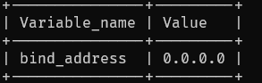
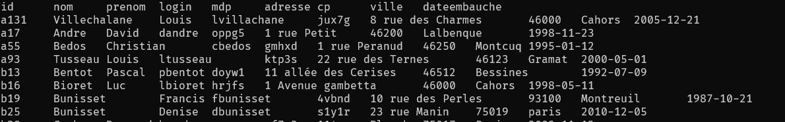
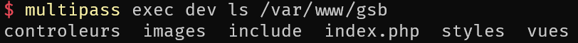
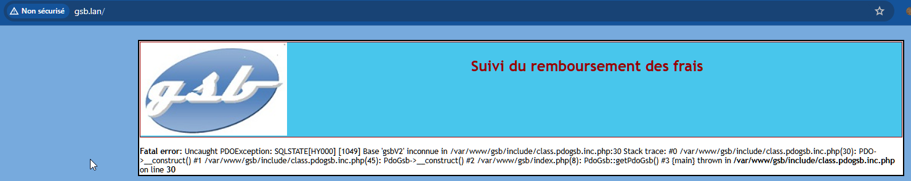
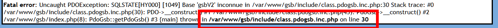
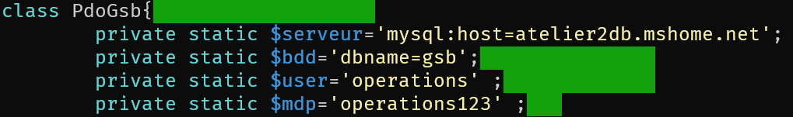
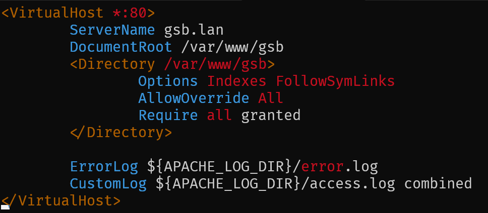

# Livrable 1

## Mise en place de l'environnement

Pour toutes les machines virtuelles, nous utilisons *multipass*.

Il faut créer 2 machines virtuelles :

- **atelier2db** : contient le serveur SQL MariaDB ainsi que la base de donnée.
- **atelier2web** : contient le serveur Apache2.

## atlier2db :

``````bash
# Créer la machine virtuelle
multipass launch --name atelier2db

# Ouvrir l'interface de la machine virtuelle
multipass shell atelier2db
``````
Faire les mises à jour et installer **MariaDB** :

``````bash
# Télécharger puis installer les mises à jour

sudo apt-get update -y 

sudo apt-get upgrade -y

# Installer MariaDB
sudo apt-get install mariadb-server -y
``````

Autoriser toutes les connexions :
``````bash
echo "[mysqld]" | sudo tee /etc/mysql/mariadb.conf.d/99-srvdb.cnf

echo "bind-address = 0.0.0.0" | sudo tee -a /etc/mysql/mariadb.conf.d/99-srvdb.cnf

# Redémarrer le service mysqld 
sudo systemctl restart mysqld

sudo mysql -b -e "SHOW GLOBAL VARIABLES like 'bind_address'"
``````
Vous devriez avoir ceci affiché :



Transfert des fichiers de **GSB-BDD** vers **atelier2db** et mise en place de la base de données :

``````bash
# Transfert des fichiers vers atelier2db
multipass transfer -r GSB-BDD atelier2db:/home/ubuntu

# Ouverture de l'interface de la machine
multipass shell atelier2db

# Accès au répertoire que l'on a fait grâce au transfer
cd GSB-BDD

# Créer un utilisateur MySQL
echo "CREATE USER IF NOT EXISTS 'operations'@'%'  IDENTIFIED BY 'operations123';" | sudo mysql

# Créer la base de donnée
echo "CREATE DATABASE IF NOT EXISTS gsb CHARACTER SET utf8mb4 COLLATE utf8mb4_unicode_520_ci;" | sudo mysql

# Attribution des droits sur la bdd à l'utilisateur que l'on a crée
echo "GRANT ALL PRIVILEGES ON gsb.* TO 'operations'@'%';" | sudo mysql

# Rafraîchissement des privilèges
echo "flush privileges;" | sudo mysql

# Importer les données de la base
cat 01_gsb_frais_structure.sql | sudo mysql -D gsb
cat 02_gsb_frais_insert_tables_statiques.sql | sudo mysql -D gsb
``````
Si vous effectuez cette commande :
``````bash
echo "select * from visiteur" | sudo mysql -D gsb
``````
Vous devriez avoir ceci affiché :



Nous avons maintenant fini la machine **atelier2db**, nous passons donc à atelier2web.

## atelier2web :

``````bash
# Créer la machine virtuelle
multipass launch --name atelier2web

# Ouvrir son interface
multipass shell atelier2web
``````
Faire les mises à jour et créer une configuration **Apache2** :

``````bash
# Télécharger puis installer les mises à jour
sudo apt-get update -y && sudo apt-get upgrade -y

# Installer Apache2
sudo apt-get install apache2 -y
``````
Nous devons maintenant mount l'application dans **/var/www/gsb** puis configurer **Apache2** :

``````bash
# Monter les fichiers web (à faire sur la machine windows)
multipass mount gsbMVC atelier2web:/var/www/gsb
``````
Si vous faites cette commande :

``````bash
multipass exec atelier2web ls /var/www/gsb
``````
Vous devriez avoir cela qui s'affiche :



Et si vous allez sur gsb.lan dans votre navigateur vous devriez avoir ceci :



Le message d'erreur nous indique où est l'erreur :



Nous allons donc aller modifier le fichier et s'assurer qu'il soit à jour :

``````bash
sudo nano /var/www/gsb/include/class.pdogsb.inc.php
``````


Nous allons maintenant créer et activer le fichier apache2 gsb.conf :

``````bash
# Modifier le fichier gsb.conf
sudo nano /etc/apache2/sites-available/gsb.conf
sudo a2dissite 000-default
sudo a2ensite gsb

# Recharger apache2
sudo systemctl reload apache2
``````
Mettre cette configuration dans le fichier :



Une fois la configuration terminée, mettre l'adresse suivante dans le navigateur : '**atelier2web.mshome.net**'.